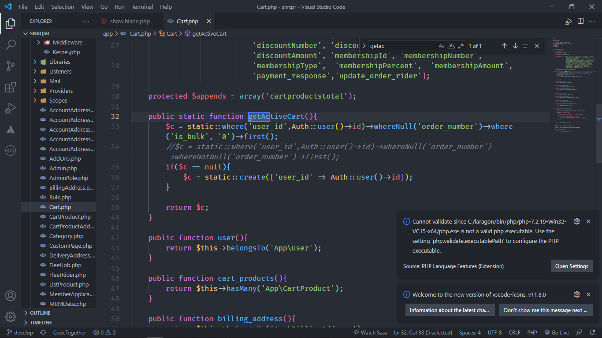

<!-- Headings -->

# Heading 1

## Heading 2

### Heading 3

#### Heading 4

##### Heading 5

###### Heading 6

<!-- Italic -->

_This is Italic Text_

<!-- Strong or Bold Text -->

**Strong Text**

<!-- Strikethrough -->

~~This is~~ striketrough

## <!-- Horizontal Rule -->

---

<!-- Blockquote -->

> This is a quote

<!-- Links -->

[Redemple Marcelo](https://www.youtube.com/channel/UClaN_yLdPUD1BkJ26VY5a4Q)

<!-- Unorderlist -->

- Item1
- Item 2
- Item 3
  - Nested Item 1
  - Nested Item 2

<!-- Order List -->

1. Item 1
2. Item 2
3. Item 3

<!-- Inline Code Block -->

`<p>This is paragraph</p>`

<!-- Insert Image -->



<!-- Code Blocks -->

```var one = 1
if (one >= 1) {
    console.log("CHANGE VAR TO 0")
 }
```

<!-- Table -->

| Firstname | Email              |
| --------- | ------------------ |
| Redemple  | Redemple@gmail.com |
| Steven    | steven@gmail.com   |

<!-- Task List -->

- [x] Task 1
- [x] Task 2
- [] Task 3

:kissing_closed_eyes:
